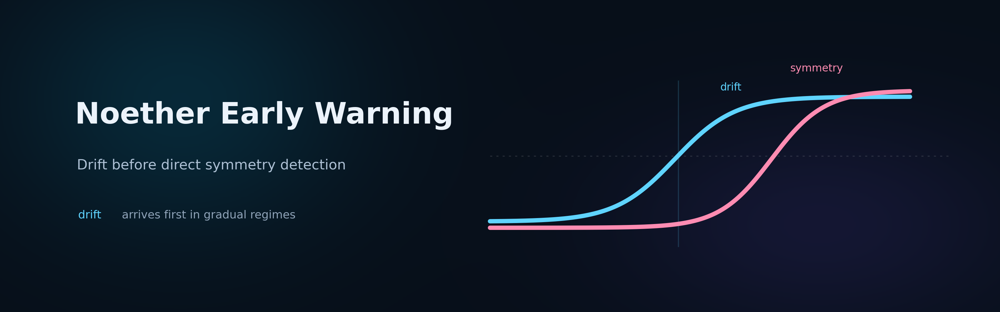
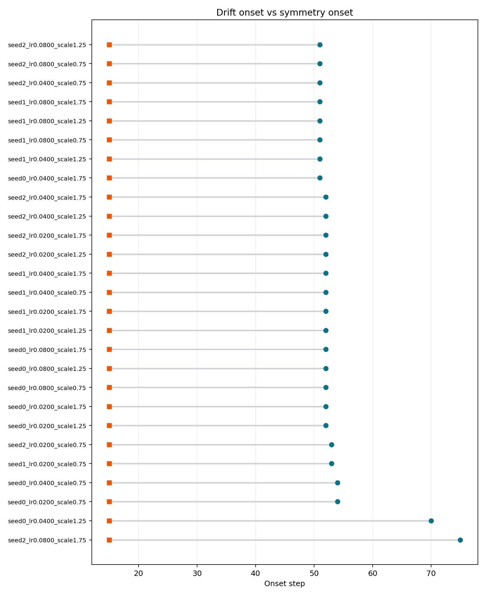
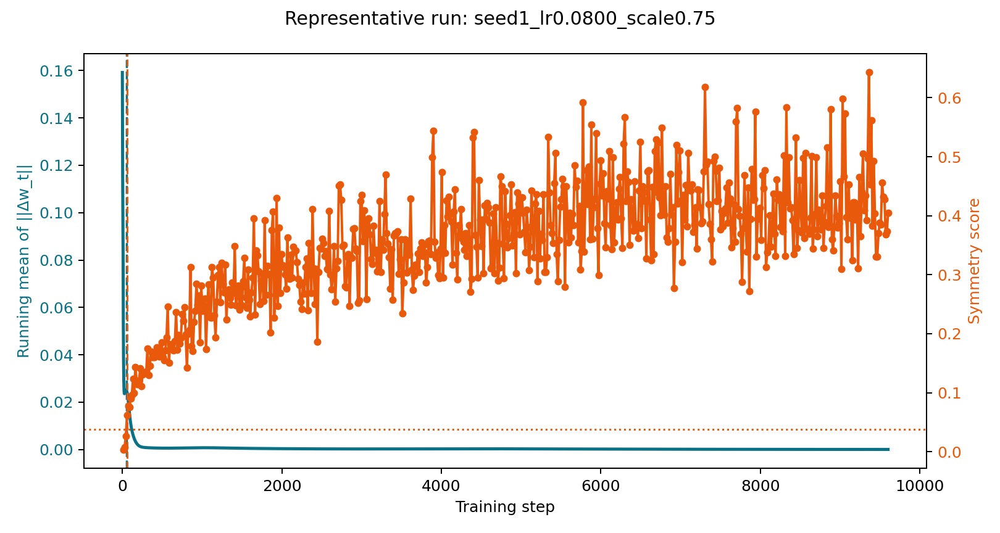

# Noether Early Warning

A benchmark suite for earlier practical detection of gradual symmetry breaking.

## What This Repo Gives You

If you monitor a system for gradual breakage, waiting for the direct symmetry metric can be too late.

This repository benchmarks when a drift-based alarm is practically more useful than a direct symmetry metric for catching gradual symmetry breaking early. It does not just ask whether one signal can appear before another in hindsight. It tests whether that advantage is real, regime-specific, visible under finite monitoring budgets, and still present at the exact moment the drift alarm fires.

That is what makes the result useful rather than merely interesting:

- in gradual regimes, drift fires first
- in instant-break controls, the ordering reverses
- under finite observation limits, drift is easier to detect
- at the alarm moment, the direct symmetry metric is usually still sub-threshold

## Executive Summary

The benchmark suite supports the full four-part claim package.

Across the consolidated `B1`-`B4` suite, every benchmark returned `SUPPORTED`. In this repository’s benchmarked regime, the evidence supports the conclusion that drift is an earlier and practically useful warning signal for gradual symmetry breaking.

The strongest high-level findings are:

- In the gradual regime, drift fired before direct symmetry detection in every run.
- In the instant-break control, the ordering reversed in every run.
- Under a fixed 300-step observation budget, drift was detected in all runs while direct symmetry was detected in only two thirds.
- At the exact drift alarm time, direct symmetry was still sub-threshold in 24 of 27 runs.

## At a Glance

The core evidence is easiest to read as a compact benchmark table:

| Benchmark | What it establishes | Result |
|---|---|---|
| `B1` | Drift leads in gradual regimes | `27/27` runs, median lead `+84` steps |
| `B2` | The effect is not generic | `27/27` runs, median lead `-37` steps |
| `B3` | Drift matters under finite monitoring limits | Drift `27/27` vs symmetry `18/27` within `300` steps |
| `B4` | Drift is useful at the exact alarm moment | `24/27` runs still sub-threshold at alarm |

## Hypothesis

The working hypothesis of this repository is that, in gradual symmetry-breaking regimes, a drift observable can become detectable before a direct symmetry observable does, and that this earlier drift signal can be practically useful as an early warning.

The intuition is that these two kinds of signal do not have to become visible on the same timescale. A direct symmetry observable may still sit below threshold while a drift observable linked to the same breakdown process is already showing a stable deviation in the time-series. If that happens consistently, then drift is not just correlated with breakdown. It becomes an early warning signal.

The practical version of the claim is stronger than “drift happens first somewhere in hindsight.” A useful early warning signal should satisfy several stricter conditions. It should appear before the direct symmetry signal in gradual regimes. That ordering should reverse in instant-break regimes rather than showing up everywhere indiscriminately. Under a finite observation budget, the drift signal should be easier to detect. And when the drift alarm fires, the direct symmetry observable should still usually remain below its own threshold.

That is the theory story this repository tests. The benchmark program reduces it into four narrow empirical claims, benchmarks each one separately, and then recombines them into a single validated findings package.

## Benchmark Design

The conclusion rests on four atomic benchmarks:

1. In a gradual-breaking regime, drift can become detectable before direct symmetry detection.
2. This ordering is not generic. In an instant-break regime, direct symmetry detection can appear at or before drift.
3. Under a fixed practical observation budget, drift can be the more sensitive detector.
4. At the time the drift alarm fires, the direct symmetry observable can still remain below its own detection threshold.

What makes the design informative is that the suite keeps the core setup controlled while varying the question each benchmark asks:

- the same paired-MLP family is used across the suite
- the same covariance-based direct symmetry detector is used across the suite
- detector thresholds are held fixed rather than retuned benchmark by benchmark
- `B2` provides the reversal control
- `B3` imposes a finite observation constraint
- `B4` measures the exact saved model state at the alarm step

The benchmark strategy is documented in [TEST_PLAN.md](/Users/velocityworks/IdeaProjects/noether-early-warning/TEST_PLAN.md), and the aligned claims document is [core_claim.md](/Users/velocityworks/IdeaProjects/noether-early-warning/docs/core_claim.md).

## Quick Start

Install dependencies from the repository root:

```bash
pip install -r requirements.txt
```

Run the consolidated benchmark suite:

```bash
python -m early_warning_research.benchmark_suite --quiet
```

Run the individual atomic benchmarks:

```bash
python -m early_warning_research.run --benchmark benchmark1
python -m early_warning_research.benchmark2
python -m early_warning_research.benchmark3
python -m early_warning_research.benchmark4
```

Run tests:

```bash
pytest -q early_warning_research/tests
```

Artifacts are written under [artifacts/](/Users/velocityworks/IdeaProjects/noether-early-warning/artifacts). The consolidated suite artifact used in this README is:

- [summary.json](/Users/velocityworks/IdeaProjects/noether-early-warning/artifacts/benchmark_suite/20260322T162428Z_benchmark_suite/summary.json)
- [REPORT.md](/Users/velocityworks/IdeaProjects/noether-early-warning/artifacts/benchmark_suite/20260322T162428Z_benchmark_suite/REPORT.md)

## Benchmark Summary

### B1: Drift Before Direct Symmetry Detection

Verdict: `SUPPORTED`

Key result:

- 27 total runs
- 27 comparable runs
- 27 supportive runs
- median lead: `+84` steps

Interpretation:

In the gradual regime, drift became detectable before direct symmetry detection in every run. This is the core early-warning effect.

Representative plots:


This timeseries shows a representative run where the drift signal rises before the direct symmetry signal crosses threshold.


This onset-ordering plot shows the same pattern across the full sweep: the direct symmetry onset sits to the right of the drift onset in every run.

### B2: Instant-Break Reversal

Verdict: `SUPPORTED`

Key result:

- 27 total runs
- 27 comparable runs
- 27 supportive runs
- median lead: `-37` steps

Interpretation:

When symmetry is intentionally broken from the start, the ordering reverses. Direct symmetry detection appears at or before drift. This shows that the B1 effect is not a generic detector artifact.

Representative plots:


This timeseries shows a representative instant-break run where direct symmetry is already visible immediately, before drift gets a chance to serve as an early warning.



This onset-ordering plot shows the reversal cleanly across the sweep: the symmetry onset is at or before the drift onset throughout.

### B3: Fixed-Budget Sensitivity

Verdict: `SUPPORTED`

Key result:

- observation budget: `300` steps
- drift detected in `27/27` runs
- direct symmetry detected in `18/27` runs
- detection-rate gap: `0.333`
- pre-registered support margin: `0.2`

Interpretation:

Under a realistic finite observation budget, drift is the more sensitive detector. In one third of runs, drift was detectable within budget while the direct symmetry detector was still silent.

Representative plots:


This representative run is a practical example of the sensitivity gap: drift becomes detectable within the observation window while direct symmetry remains undetected.


This plot visualizes which runs yield both detections within budget and which runs only yield drift within budget.

### B4: Exact Alarm-Time Separation

Verdict: `SUPPORTED`

Key result:

- 27 total runs
- 27 exact alarm-state measurements
- 24 supportive runs
- 3 falsifying runs
- supportive fraction: `0.889`

Interpretation:

At the exact moment the drift alarm fired, direct symmetry was still below its own threshold in the large majority of runs. This is the strongest direct evidence for practical utility: the alarm usually fires while the direct detector is still sub-threshold.

Representative plots:



This timeseries should be read together with the benchmark definition: the plotted threshold crossing is eventual, but the benchmark verdict is based on the exact saved model state at the drift alarm time.


This plot gives context for how close the drift alarm typically sits to the eventual direct symmetry onset, while the actual B4 decision is made on the exact alarm-state measurement.

## Technical Notes

### Experimental Setup

All four benchmarks use the same core paired-MLP family and the same direct symmetry detector:

- direct symmetry detector: `covariance_mismatch`
- drift detector: rolling update-norm onset detector
- seeds: `0, 1, 2`
- learning rates: `0.02, 0.04, 0.08`
- input scales: `0.75, 1.25, 1.75`

This yields `27` runs per benchmark.

### What Was Held Fixed

To keep the benchmarks comparable, the detector configuration was held fixed across the suite:

- `drift_window = 50`
- `drift_running_mean_window = 10`
- `drift_effect_floor = 0.05`
- `drift_p_threshold = 1e-6`
- `symmetry_baseline_probes = 3`
- `symmetry_z_threshold = 2.5`
- `symmetry_floor = 0.02`

### Why the Suite Is Convincing

The package works because the four benchmarks answer different questions cleanly rather than mixing them together:

- `B1` establishes the ordering.
- `B2` establishes the reversal control.
- `B3` establishes finite-budget sensitivity.
- `B4` establishes exact alarm-time practical separation.

Taken together, they do not just show that drift can come first. They show that the signal is early, regime-specific, more sensitive under practical limits, and still useful at the moment the alarm actually fires.

## Fine-Grained Breakdown

### B1 Fine-Grained View

- Artifact: [summary.json](/Users/velocityworks/IdeaProjects/noether-early-warning/artifacts/benchmark1/20260322T152418Z_benchmark1/summary.json)
- All 27 runs were comparable and supportive.
- The median lead was `84` steps, but some runs had much larger separations.
- This means the early-warning effect is not a marginal edge case in the benchmarked gradual regime.

### B2 Fine-Grained View

- Artifact: [summary.json](/Users/velocityworks/IdeaProjects/noether-early-warning/artifacts/benchmark2/20260322T154257Z_benchmark2/summary.json)
- All 27 runs were comparable and supportive for the reversal claim.
- The median lead was `-37` steps.
- This is an important falsification guard: if direct symmetry is already broken, the ordering flips the other way.

### B3 Fine-Grained View

- Artifact: [summary.json](/Users/velocityworks/IdeaProjects/noether-early-warning/artifacts/benchmark3/20260322T155414Z_benchmark3/summary.json)
- Drift was detected within 300 steps in every run.
- Direct symmetry was detected within the same 300-step budget in only 18 runs.
- The `9` drift-only runs are the practical win cases for the hypothesis.

### B4 Fine-Grained View

- Artifact: [summary.json](/Users/velocityworks/IdeaProjects/noether-early-warning/artifacts/benchmark4/20260322T161101Z_benchmark4/summary.json)
- The final benchmark design uses the exact saved model state at the drift-onset step.
- This corrected an earlier draft benchmark that used the next scheduled probe and therefore misstated the practical claim.
- Under the corrected design, `24/27` exact alarm-state measurements were supportive.
- The three falsifying runs were fast-break boundary cases, not a collapse of the benchmark.

## Project Structure

- [core_claim.md](/Users/velocityworks/IdeaProjects/noether-early-warning/docs/core_claim.md): aligned claims document
- [TEST_PLAN.md](/Users/velocityworks/IdeaProjects/noether-early-warning/TEST_PLAN.md): atomic benchmark strategy
- [FINDINGS_REPORT.md](/Users/velocityworks/IdeaProjects/noether-early-warning/docs/FINDINGS_REPORT.md): standalone findings report
- [early_warning_research](/Users/velocityworks/IdeaProjects/noether-early-warning/early_warning_research): benchmark implementations
- [archive](/Users/velocityworks/IdeaProjects/noether-early-warning/archive): historical exploratory material

## Bottom Line

The benchmark suite supports the full claims package expressed in [core_claim.md](/Users/velocityworks/IdeaProjects/noether-early-warning/docs/core_claim.md).

The main conclusion is simple:

In the benchmarked gradual symmetry-breaking regime, drift is not only earlier than direct symmetry detection. It is earlier in a way that is practically useful.
