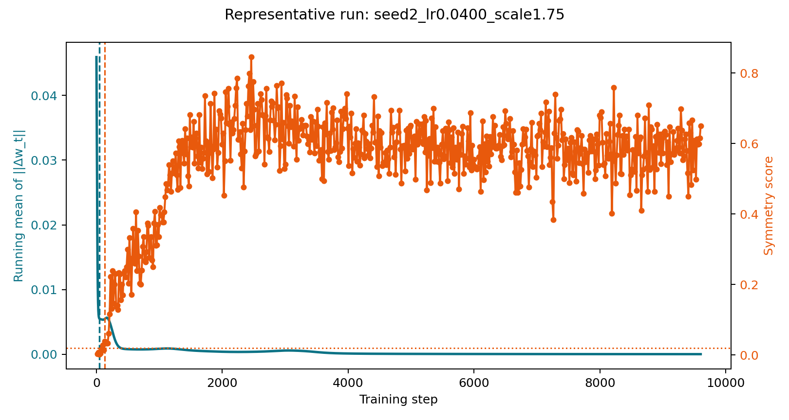
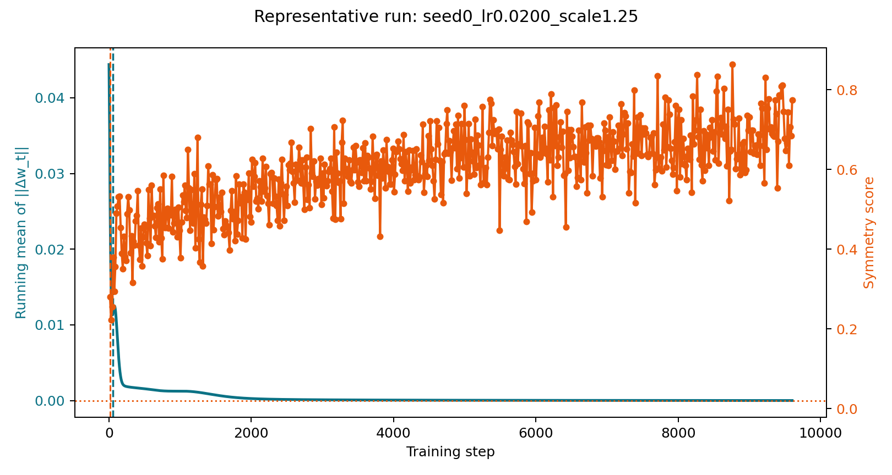
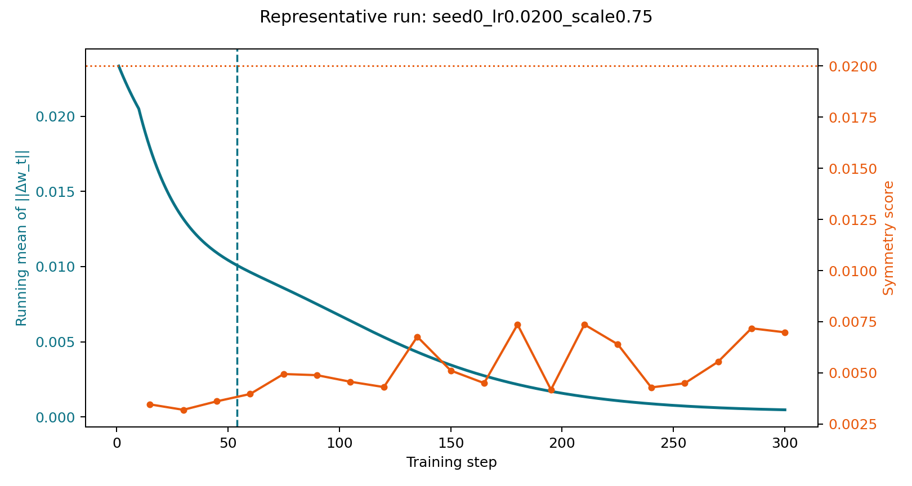
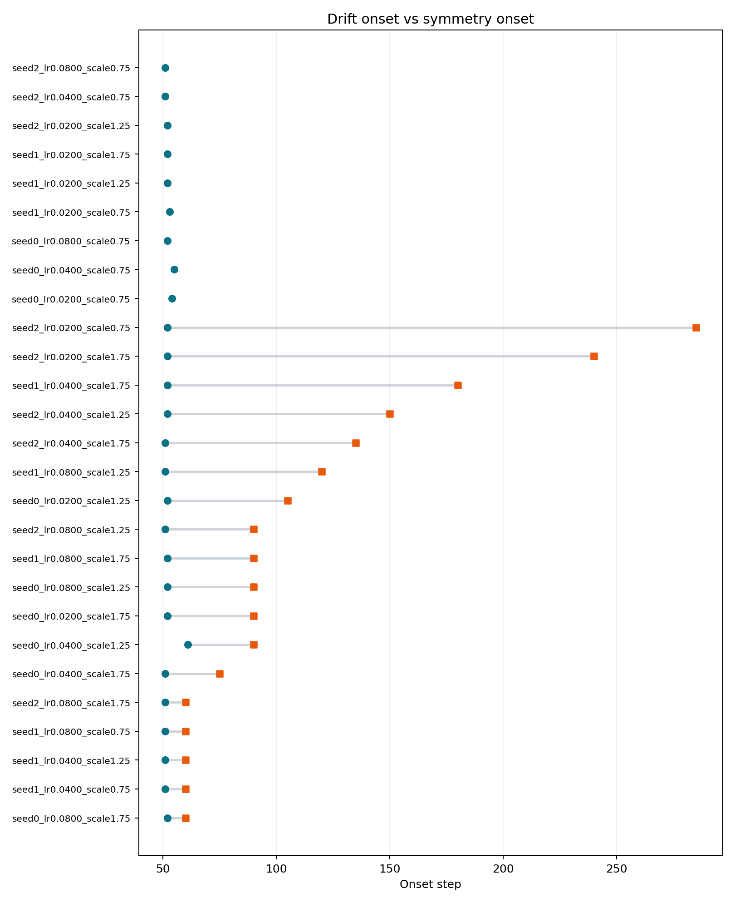

# B1-B4 Consolidated Benchmark Report

Generated: 2026-03-22T16:29:08.131012+00:00

Overall result: the validated benchmark package supports the claims document.

## At a Glance

| Benchmark | What it establishes | Result |
|---|---|---|
| `B1` | Drift leads in gradual regimes | `27/27` runs, median lead `+84` steps |
| `B2` | The effect is not generic | `27/27` runs, median lead `-37` steps |
| `B3` | Drift matters under finite monitoring limits | Drift `27/27` vs symmetry `18/27` within `300` steps |
| `B4` | Drift is useful at the exact alarm moment | `24/27` runs still sub-threshold at alarm |

## Details

### B1

Claim tested: drift becomes detectable before direct symmetry detection.

Verdict: `SUPPORTED`

- total_runs: `27`
- drift_detected_runs: `27`
- comparable_runs: `27`
- supportive_runs: `27`
- falsifying_runs: `0`
- symmetry_miss_runs: `0`
- drift_miss_runs: `0`
- comparable_fraction: `1.0`
- supportive_fraction_total: `1.0`
- median_lead_steps: `84.0`
- informative: `True`

Artifacts: [benchmark1/20260322T162428Z_benchmark1](benchmark1/20260322T162428Z_benchmark1)

### B2

Claim tested: direct symmetry detection appears at or before drift in an instant-break regime.

Verdict: `SUPPORTED`

- total_runs: `27`
- symmetry_detected_runs: `27`
- comparable_runs: `27`
- supportive_runs: `27`
- falsifying_runs: `0`
- symmetry_miss_runs: `0`
- drift_miss_runs: `0`
- comparable_fraction: `1.0`
- supportive_fraction_total: `1.0`
- median_lead_steps: `-37.0`
- informative: `True`

Artifacts: [benchmark2/20260322T162601Z_benchmark2](benchmark2/20260322T162601Z_benchmark2)

### B3

Claim tested: under a fixed practical observation budget, drift is the more sensitive detector.

Verdict: `SUPPORTED`

- total_runs: `27`
- drift_detected_runs: `27`
- symmetry_detected_runs: `18`
- drift_detection_rate: `1.0`
- symmetry_detection_rate: `0.6666666666666666`
- detection_rate_gap: `0.33333333333333337`
- margin_threshold: `0.2`
- informative: `True`

Artifacts: [benchmark3/20260322T162732Z_benchmark3](benchmark3/20260322T162732Z_benchmark3)

### B4

Claim tested: at the drift alarm time, direct symmetry is still below its own detection threshold.

Verdict: `SUPPORTED`

- total_runs: `27`
- drift_detected_runs: `27`
- alarm_state_runs: `27`
- supportive_runs: `24`
- falsifying_runs: `3`
- no_alarm_state_runs: `0`
- supportive_fraction_alarm_state: `0.8888888888888888`
- informative: `True`

Artifacts: [benchmark4/20260322T162735Z_benchmark4](benchmark4/20260322T162735Z_benchmark4)

