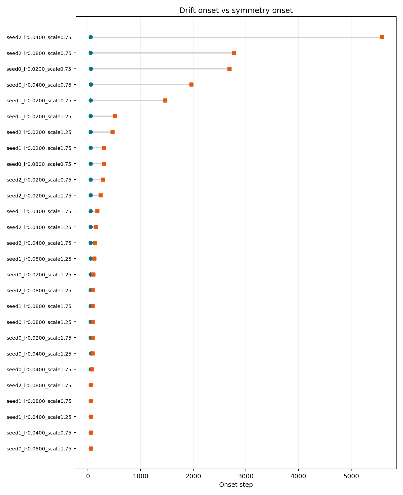

**Keywords:** early warning; symmetry breaking; drift detection; training dynamics; benchmarking; neural networks; optimization

# Opening Statement

This note addresses a specific technical question: can a drift observable become detectably and usefully earlier than a direct symmetry observable under gradual symmetry breaking? The issue is not merely whether one signal can precede another in retrospect. The issue is whether the earlier signal remains operationally meaningful under fixed detection rules and realistic monitoring constraints.

The result presented here is a benchmarked empirical claim, not a universal law and not a first-principles derivation. The note does not attempt to prove that drift must lead direct symmetry detection in all systems. Instead, it defines a four-part practical early-warning claim and evaluates that package in a controlled benchmarked regime.

The note therefore centers on a four-benchmark structure and its validated outcome in the paired-MLP regime implemented in the repository [@noetherearlywarning2026]. The claim package is cumulative: each benchmark tests a distinct requirement that must hold if drift is to count as a practically useful early warning rather than simply an earlier signal in hindsight. A follow-on detector-latency sweep is also reported later in the note as strengthening evidence rather than as an additional core benchmark.

# Core Claim

The core claim of this note is that drift can function as an earlier and practically useful observable than direct symmetry detection under gradual symmetry breaking.

The claim package has four parts:

1. In a gradual-breaking regime, drift becomes detectable before direct symmetry detection.
2. This ordering is not generic; in an instant-break regime, direct symmetry detection appears at or before drift.
3. Under a fixed practical observation budget, drift is the more sensitive detector.
4. At the time the drift alarm fires, the direct symmetry observable remains below its own detection threshold in a large majority of runs.

Taken together, these four claims define the practical early-warning statement tested in this repository. The package is stronger than a simple precedence claim because it also tests regime specificity, finite-budget usefulness, and alarm-time usefulness.

# Why the Claim Is Nontrivial

Claims about detector ordering are weak when they only show that one signal can appear before another in hindsight. Many indirect statistics can move before more explicit state variables do, but that fact alone does not establish that the earlier statistic is a meaningful warning signal.

The present work tests a stricter package. It asks not only whether drift leads direct symmetry detection in the claim-bearing regime, but also whether that lead disappears or reverses in a matched instant-break control, whether the lead matters under finite observation limits, and whether the direct symmetry observable is still sub-threshold at the exact moment the drift alarm fires.

The contribution is therefore the benchmarked structure of the claim rather than merely the observation that one signal can precede another. The four-part package turns a broad early-warning intuition into a falsifiable operational framework.

# Benchmark Logic

The benchmark program is built around two observable families. The first is a drift observable, defined here through a training-time signal that accumulates through the update process. The second is a direct symmetry observable, defined through a detector that measures visible symmetry violation in the monitored structure itself.

In this note, detectability is treated as an operational event rather than a vague visual impression. A signal counts as detectable when it crosses a pre-registered detection rule. That framing matters because the note is about practical early warning, and practical early warning depends on when an alarm is actually triggered, not when a curve begins to look different by eye.

Benchmark 1 is the minimal ordering benchmark. It asks whether the drift observable becomes detectable before the direct symmetry observable in the gradual claim-bearing regime. Without this benchmark there is no early-warning effect to discuss.

Benchmark 2 is required to rule out generic detector earliness. If the drift detector always fired first, then Benchmark 1 alone would be uninformative. The instant-break control therefore asks whether the ordering reverses in a regime where direct symmetry breaking is already present from the start.

Benchmark 3 is required because practical usefulness depends on observation limits. A detector that wins only in a long-horizon post hoc comparison may not be useful in practice. Benchmark 3 therefore asks whether drift is easier to detect than direct symmetry within a fixed finite observation window.

Benchmark 4 is required because even finite-budget sensitivity is still not the same as alarm-time usefulness. A drift detector is most compelling as an early warning if, at the exact moment the alarm fires, the direct symmetry detector is usually still silent. Benchmark 4 is designed to test exactly that condition using the saved model state at drift onset.

The resulting four benchmarks form a cumulative practical early-warning test rather than four disconnected experiments. Benchmark 1 establishes existence, Benchmark 2 establishes regime specificity, Benchmark 3 establishes finite-budget utility, and Benchmark 4 establishes alarm-time utility.

# Experimental Setup

All four benchmarks are evaluated in the same paired-MLP regime used throughout the repository. The model family is a paired-hidden-unit multilayer perceptron with near-symmetric initialization in the claim-bearing suite and intentionally broken initialization in the instant-break control. The shared architecture keeps the benchmark family coherent while still permitting regime comparisons.

The shared detector setup consists of an update-norm-based drift detector and a covariance-mismatch direct symmetry detector. The drift detector uses a rolling onset rule on update norms, while the direct detector uses covariance mismatch across paired units with fixed baseline and threshold logic. Detector settings are held fixed across the suite rather than retuned benchmark by benchmark.

The sweep parameters are also shared across the suite. Each benchmark runs the same grid of three seeds, three learning rates, and three input scales, yielding twenty-seven runs per benchmark. This common sweep structure allows the benchmark outcomes to be compared directly without changing the underlying coverage of the parameter space.

The horizon choices differ only where required by the claim. Benchmarks 1, 2, and 4 use a long uncensored horizon, while Benchmark 3 uses a fixed 300-step observation budget. This keeps the suite aligned with the question each benchmark is intended to answer rather than mixing long-horizon and short-horizon logic within a single claim.

# Benchmark 1: Ordering in the Gradual Regime

Benchmark 1 tests the foundational ordering claim: in the gradual claim-bearing regime, drift becomes detectable before direct symmetry detection.

The decision rule is simple. For each run, the benchmark records the drift onset step and the direct symmetry onset step. A run is supportive if the drift onset occurs first, falsifying if direct symmetry onset occurs first or at the same time, and informative only when both onsets are measurable.

The result is unambiguous. All twenty-seven runs were supportive, and all twenty-seven were comparable. The median lead was +84 steps.

This establishes the base early-warning effect in the benchmarked gradual regime. Drift is not merely sometimes earlier. In this benchmark, it was earlier in every run under the fixed detection rules.

{ width=92% }

# Benchmark 2: Reversal in the Instant-Break Control

Benchmark 2 tests the control claim: in an instant-break regime, direct symmetry detection should appear at or before drift.

The logic of this benchmark is to test whether the Benchmark 1 ordering is genuinely tied to gradual symmetry breaking rather than reflecting a detector that simply fires early in all circumstances. The matched control uses intentionally broken symmetry at initialization and asks whether the ordering reverses.

Again the result is clean. All twenty-seven runs were supportive for the reversal claim, and all twenty-seven were comparable. The median lead was -37 steps, meaning direct symmetry detection appeared earlier than drift.

This is strong evidence that the Benchmark 1 effect is not a generic detector-ordering artifact. The same benchmark machinery that yields drift-first behavior in the gradual regime yields symmetry-first behavior in the instant-break regime.

{ width=92% }

# Benchmark 3: Fixed-Budget Sensitivity

Benchmark 3 tests the finite-budget sensitivity claim: under a fixed practical observation budget, drift is the more sensitive detector.

The benchmark defines a 300-step observation budget and asks, within that budget, whether each detector fires. This changes the question from eventual onset ordering to constrained detectability under realistic monitoring limits.

The result shows a clear gap. Drift was detected in twenty-seven out of twenty-seven runs within the budget, while direct symmetry was detected in only eighteen out of twenty-seven runs. The resulting detection-rate gap was 0.333.

This is evidence that drift is the more sensitive practical detector under finite observation constraints. In one third of runs, drift was already detectable while the direct symmetry detector was still silent within the same monitoring window.

{ width=92% }

# Benchmark 4: Exact Alarm-Time Separation

Benchmark 4 tests the strongest practical claim: at the time the drift alarm fires, the direct symmetry observable remains below its own detection threshold.

This benchmark is based on a corrected design. Instead of evaluating the direct symmetry score at a later scheduled probe, it evaluates the exact saved model state immediately after the update at the drift-onset step. This makes the benchmark a true same-timepoint test rather than a delayed proxy.

Under that corrected design, twenty-four of twenty-seven runs were supportive and three were falsifying.

This is the strongest direct evidence in the suite that the drift alarm is practically useful rather than only earlier in hindsight. In the benchmarked regime, the direct symmetry observable is usually still sub-threshold at the exact moment the drift alarm fires.

{ width=92% }

# Consolidated Result

Taken together, the four benchmarks support a single coherent claim package. Benchmark 1 shows that drift becomes detectable earlier in the gradual regime. Benchmark 2 shows that this ordering is regime-specific rather than generic. Benchmark 3 shows that the effect survives finite observation limits in a practically relevant way. Benchmark 4 shows that the effect is still useful at the exact moment the alarm would actually be used.

The cumulative logic matters. Benchmark 1 alone would show only an ordering result. Benchmark 2 shows that the ordering depends on the regime. Benchmark 3 shows that the ordering has practical value under monitoring constraints. Benchmark 4 shows that the practical value survives at the actual alarm time rather than collapsing into a delayed-probe artifact.

The combined conclusion is therefore stronger than any single benchmark alone: in the benchmarked paired-MLP regime, drift functions as an earlier and practically useful warning signal than direct symmetry detection under gradual symmetry breaking.

# Detector-Latency Sweep

As a follow-on robustness check, the repository also evaluates whether the main split between the gradual and instant-break regimes survives explicit changes to detector cadence and confirmation rules. This sweep varies symmetry probe cadence across `{5, 10, 15, 20, 30}` steps, symmetry baseline probes across `{2, 3, 4}`, and symmetry consecutive-hit requirements across `{1, 2, 3}`. The point of the sweep is not to create a fifth benchmark. It is to test whether the regime-level result remains after detector mechanics are perturbed on purpose.

The sweep was executed by running each training configuration once with dense symmetry probing every five steps and then deriving the coarser cadences by subsampling those same probe traces. Latency normalization was computed explicitly from the structural floor implied by the detector rules at each setting. This keeps the comparison focused on the quantity of interest: excess lead beyond detector opportunity.

The result is stable at the regime level. Across all forty-five detector settings, the median excess lead remained positive in the gradual `B1` regime and non-positive in the instant-break `B2` control. The excess-median range was `45` to `110` in `B1` and `-121` to `-11` in `B2`. Full run-level sign consistency held in eighteen of the forty-five settings, so the strongest invariant is the regime-level split rather than identical per-run behavior under every setting.

This sweep sharpens the interpretation of the main benchmark package. Raw lead magnitude is detector-sensitive and moves substantially as cadence, baseline count, and confirmation rules are changed. The regime-level excess-horizon split, however, is not explained away by those changes in the tested grid. The data therefore support a stronger reading of the main result: the gradual regime retains a real latency-normalized warning advantage, while the instant-break regime does not.

# Limits and Scope

This note validates the claim package only in the benchmarked paired-MLP regime implemented in this repository. That is the scope of the present evidence.

The note does not claim universal validity across all systems, architectures, or optimization settings. Broader generality would require additional benchmark instantiations rather than stronger wording alone.

The note also does not provide a first-principles derivation of the effect. The result presented here is empirical and operational: it is established through the benchmark logic and the observed benchmark outcomes.

The detector-latency sweep reported here is a follow-on robustness result inside the same paired-MLP regime. It should not be read as a claim of universal invariance across all detector designs or all symmetry-breaking systems.

Deeper mechanism questions and broader instantiation remain future work. The present note should therefore be read as a technical note on a validated benchmarked claim package, not as a general theorem about all symmetry-breaking systems.

# Practical Interpretation

The practical meaning of the result is straightforward. In systems where breakdown is gradual rather than instantaneous, it can be useful to monitor a drift signal before waiting for a direct symmetry metric to cross threshold.

This matters because direct symmetry metrics may lag the underlying transition. If a drift alarm becomes detectable first and remains informative under finite monitoring limits, then it can serve as an earlier decision signal rather than merely an earlier retrospective observation.

The reversal control and the alarm-time result are especially important for that practical interpretation. The reversal control shows that the effect is not generic, while the alarm-time result shows that the direct detector is usually still silent when the drift alarm fires. Those two facts are what make the early-warning claim operationally credible.

# Conclusion

This note has presented a four-part benchmark package for early warning from drift before direct symmetry detection. The package tests ordering in the gradual regime, reversal in the instant-break control, finite-budget sensitivity, and exact alarm-time separation.

In the benchmarked regime, all four benchmarks support the claim package. The follow-on detector-latency sweep strengthens that interpretation by showing that the regime-level sign split survives the tested cadence, baseline, and confirmation changes. The clean takeaway is that drift is earlier than direct symmetry detection in a way that is practically useful, not merely earlier in hindsight.

# Artifact References

- [Aligned claims document](../docs/core_claim.md)
- [Atomic benchmark test plan](../docs/benchmark_test_plan.md)
- [Consolidated benchmark suite summary](../artifacts/benchmark_suite/20260322T162428Z_benchmark_suite/summary.json)
- [Consolidated benchmark suite report](../artifacts/benchmark_suite/20260322T162428Z_benchmark_suite/REPORT.md)
- [Detector-latency sweep summary](../artifacts/exploratory/20260323T082341Z_latency_sweep/summary.json)
- [Detector-latency sweep pair-setting summary](../artifacts/exploratory/20260323T082341Z_latency_sweep/pair_setting_summary.csv)
